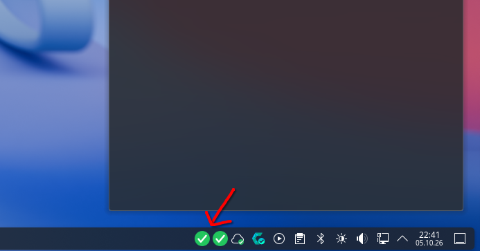

# Show Favicon

A KDE Plasma 6 panel widget that shows the favicon of each website you monitor,
and opens the site when you click the icon.

- One icon per website in the panel, as many as you configure
- Left-click opens the site in the default browser, middle-click opens a status
  popup, right-click opens the settings
- Every favicon is refreshed once an hour
- A site that cannot be reached keeps its last icon, drawn grayscale
- Drag a URL onto the icons: on an icon it replaces that site, beside them it
  adds a new one



## Requirements

| | |
| --- | --- |
| Desktop | KDE Plasma 6 |
| Qt | 6.5 or newer — Core, Network, Gui, Svg, and Test for the suite |
| Build | CMake 3.20 or newer, Ninja, a C++20 compiler |
| Optional | `qmlscene6` (Qt Declarative) to run the QML checks |

No Python, no ImageMagick and no Pillow: Qt does the fetching, the decoding and
the grayscale copy.

## Build and install

```sh
./install.sh      # Release, built into ./build-local and installed into ~/.local
./build.sh        # Debug, built into ./build — build only, no install
```

Both are thin wrappers around CMake; by hand it is the same few commands:

```sh
cmake -B build -G Ninja -DCMAKE_BUILD_TYPE=Release
cmake --build build
cmake --install build --prefix "$HOME/.local"
```

The install puts three things into `~/.local`: the `showfavicon` binary in
`bin/`, the plasmoid package in `share/plasma/plasmoids/`, and the icon in the
icon theme.

In VS Code the same steps are the tasks **Install: local (build + install to
~/.local)** and **Plasma: reload widget** — the second one is needed because
Plasma compiles an applet's QML once and keeps it, so a changed widget does not
appear until the shell reads the package again.

Then add it: right-click the panel → **Add Widgets** → *Show Favicon*.

## Using it

| Gesture | What happens |
| --- | --- |
| Left-click an icon | the site opens in the browser |
| Middle-click the widget | the status popup opens: every site with its last update and whether it is reachable |
| Right-click the widget | *Configure Show Favicon…* |
| Drop a URL on an icon | that site is replaced |
| Drop a URL beside the icons | the site is appended |
| Drop the URL of a site already monitored | that site is refreshed |

The settings dialog holds one row per website. A row is edited in place and
committed when it loses focus; *Add website* appends an empty row and *Remove*
drops one. The list starts empty, so a fresh widget shows a placeholder until the
first website is added.

## Command line

The widget runs the `showfavicon` binary once per site. It is a normal program
and works on its own — one URL in, one JSON object out:

```sh
$ showfavicon https://example.com
{"error":"","file":"/home/you/.local/share/showfavicon/example.com-327c3fda.png",
 "grayFile":"…-327c3fda.gray.png","hash":"1a126d61…","ok":true,
 "site":"https://example.com"}
```

`ok` is false when the site could not be reached. The cached paths are reported
anyway, which is what lets the widget keep showing the last icon, dimmed: the
binary never deletes a good icon because a fetch failed.

| Option | |
| --- | --- |
| `--cache-dir DIR` | where to write the icons (default `~/.local/share/showfavicon`) |
| `--verbose` / `--debug` | what it is doing, on stderr — stdout stays one JSON line |
| `--no-color` | no escape sequences even on a terminal |
| `--version`, `--help` | |

## How it works

Two halves, split where the work is:

- **C++ / Qt**, `src/` — everything with a decision or I/O: the HTTP fetches,
  the scan for `<link rel="icon">`, the decode (PNG, JPEG, ICO, SVG), the
  scaling, the grayscale copy, the cache and the JSON reply.
- **QML**, `plasmoid/` — the panel item and its settings page. It draws icons,
  reacts to clicks and drops, and calls the binary; it has no network and no
  filesystem of its own.

Each site caches to two files, named after the host and a digest of the URL:
`<host>-<sha1(url)[:8]>.png` and the same with `.gray.png`. A cached icon that is
larger than 128 px on its long edge is scaled down; a smaller one is kept as it
is, because a 16 px favicon blown up to 128 px is only a blurry 16 px favicon.

The whole exchange is one process per site per hour, so there is no daemon and
nothing running in the background between refreshes.

## Tests

```sh
ctest --test-dir build --output-on-failure
```

| Test | What it covers |
| --- | --- |
| `faviconstore` | the cache key (which matches the first, script based version, so an existing cache stays valid), the atomic write, the sha1 |
| `faviconresolver` | which `<link rel=icon>` wins, relative and absolute hrefs, the `/favicon.ico` fallback |
| `faviconfetcher` | the HTTP exchange against a stub server in the test: redirects, 404, a refused connection, a timeout, binary bytes |
| `faviconimage` | decoding, scale-down, the grayscale copy with its alpha channel kept, a hand-built ICO |
| `plasmoid-logic` | the drop decisions in `logic.js`, run headless with `qmlscene6` |
| `plasmoid-configpage` | the settings page, which `plasmawindowed` never loads — a page that fails to load costs the whole dialog and reports nothing |
| `plasmoid-structure` | that `config.qml` is a `ConfigModel` and every `main.xml` entry has a `cfg_` property on a page |

## Plan

`doc/plan-kde-linux.md` is the plan this implementation follows, with a progress
list of what is built and what is left.

## Vibecoded

Vibe coded with DeepSeek V4 Flash in VS Code 1.140.0 via the `vizards.deepseek-v4-for-copilot` extension 0.9.3.

## License

MIT, see [`LICENSE`](LICENSE).
